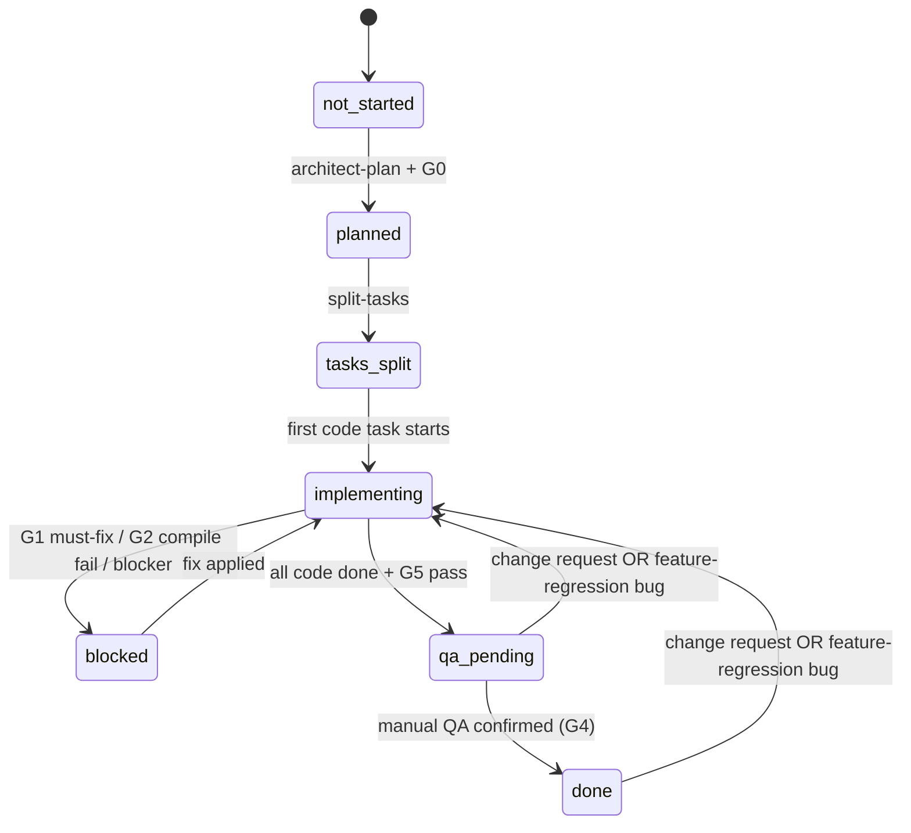
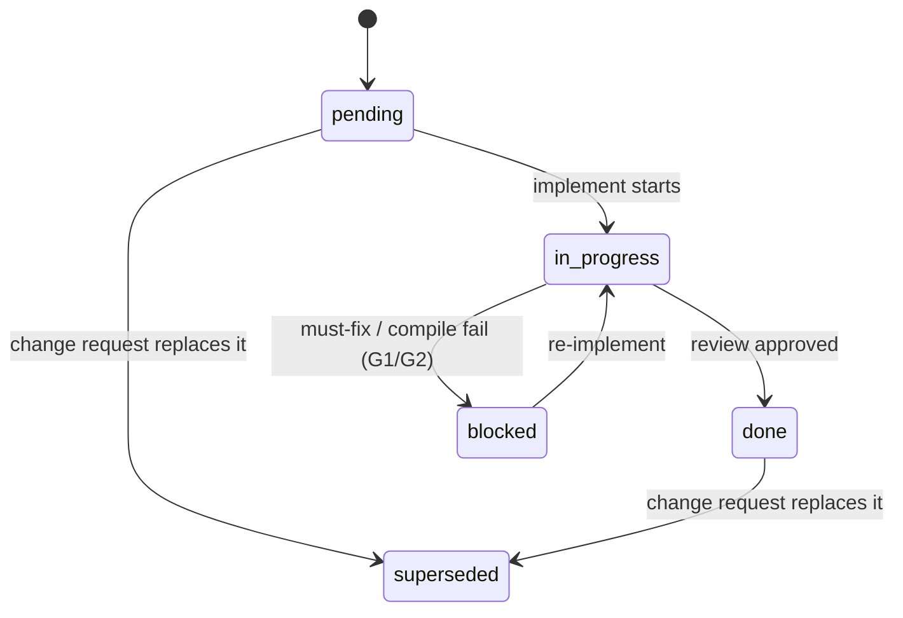
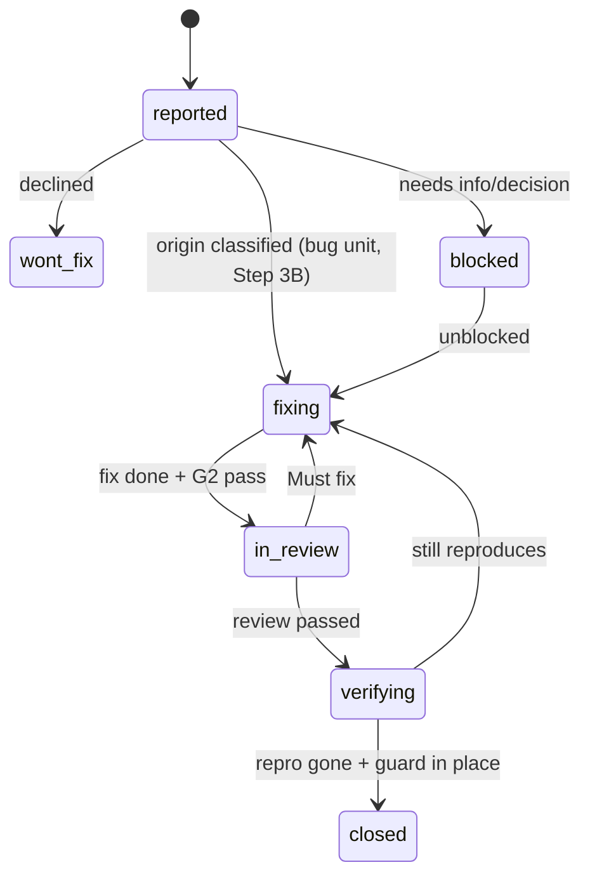

# Pipeline state machine (canonical)

Single source of truth for the states a feature and its tasks may hold, and the
**only** transitions allowed between them. `status.yaml` must always carry a value
from these enums; `/build-feature --resume` decides what to do next **from the state**,
not from ad-hoc heuristics. Stack-neutral — applies to any project using this pipeline.

## Feature-level state — `overall`

| State          | Meaning                                                        | How it is entered                          |
|----------------|----------------------------------------------------------------|--------------------------------------------|
| `not_started`  | Feature registered; no plan yet.                               | initial                                    |
| `planned`      | `plan.md` exists and was confirmed at Gate G0.                 | architect-plan + G0                        |
| `tasks_split`  | Task files exist under `tasks/`.                               | split-tasks                                |
| `implementing` | Code tasks are being implemented/reviewed (per-task loop).     | first code task starts                     |
| `qa_pending`   | All code tasks `done`, security (G5) passed; validation tasks await manual QA. | last code task done + G5 pass |
| `done`         | Every task `done`, including validation.                       | manual QA confirmed at G4                  |
| `blocked`      | A gate stopped the flow or a task is `blocked`.                | G1 must-fix / G2 compile fail / any blocker |

### Allowed feature transitions

Any transition **not** listed is illegal. A `qa_pending`/`done` feature moves backward into
`implementing` only via a **processed change request** (CR gate in `build-feature.md`) **or a
feature-regression bug** (`/fix-bug` Step 3A); either may require re-entering `tasks_split` if
new tasks are added. Legacy/pre-existing bugs do **not** touch feature state — they run their
own lifecycle below.

## Task-level state — `status`

| State         | Meaning                                                     |
|---------------|-------------------------------------------------------------|
| `pending`     | Not started.                                                |
| `in_progress` | Being implemented.                                          |
| `blocked`     | Review returned **Must fix**, or compile (G2) failed.       |
| `done`        | Implemented + review approved (code); or confirmed (validation). |
| `superseded`  | Replaced by a later task / change request.                  |

### Allowed task transitions

**Validation tasks** (`type: validation`) are special: they may only go
`pending → done` via **manual QA confirmation at Gate G4** — never auto-marked by the
implement loop.

## Bug lifecycle — `AI/bugs/BUG-NNN` `status` (driven by `/fix-bug`)

A defect is its own unit, independent of features. It reuses the same gates (G2 compile,
review, verify) but has its own states.

| State       | Meaning                                                            |
|-------------|-------------------------------------------------------------------|
| `reported`  | Captured with repro + severity; origin not yet fixed.             |
| `fixing`    | Minimal fix being implemented (developer guardrails apply).       |
| `in_review` | Fix under review; Must-fix sends it back to `fixing`.             |
| `verifying` | Repro re-run; confirming it no longer reproduces + guard in place.|
| `closed`    | Fixed, verified, regression guard added.                          |
| `wont_fix`  | Deliberately not fixed (record the reason).                       |
| `blocked`   | Cannot proceed (needs info / decision / upstream fix).            |

**Feature-regression bugs** (Step 3A) instead reopen the owning feature
(`done`/`qa_pending → implementing`) and ride the feature state machine via an appended
fix task; the bug record tracks `reported → … → closed` alongside, closing when the feature
re-QA passes.

## Gate → transition map (how the orchestrator drives state)

| Gate | Fires when | Effect on state |
|------|------------|-----------------|
| G0   | plan produced             | `not_started → planned` (after user confirm) |
| —    | tasks written             | `planned → tasks_split`                       |
| —    | first code task starts    | `tasks_split → implementing`; task `pending → in_progress` |
| G2   | compile fails             | task `in_progress → blocked`; feature `→ blocked` |
| G1   | review = Must fix         | task `in_progress → blocked`; feature `→ blocked` |
| —    | review = Approved (inline, per task) | task `in_progress → done`          |
| G3   | all code done → **independent** review of the whole feature diff (cold `reviewer` subagent) | Must-fix → task(s) `→ blocked`, feature `→ blocked`; else continue |
| G5   | G3 passed, security ok    | feature `implementing → qa_pending`          |
| G4   | manual QA confirmed       | validation tasks `pending → done`; feature `qa_pending → done` |
| CR   | change request processed  | feature `qa_pending`/`done` → `implementing` (+ `tasks_split` if new tasks) |

## Invariants (lint may enforce later)

- `overall` is always one of the feature-level states above.
- Every task `status` is one of the task-level states above.
- Feature is `qa_pending` **only if** no code task is `pending`/`in_progress`/`blocked`.
- Feature is `done` **only if** every task is `done` or `superseded`.
- Feature is `blocked` **iff** at least one task is `blocked` (or a gate recorded a blocker).
